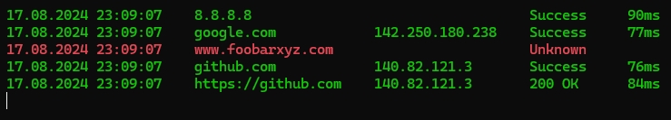

# BzPing

My improved version of the native `ping` command.

## Differences

* timestamp for every line
* colored output
* unlimited retries by default
* possibility to ping multiple hosts with one command
  * and therefore with only one command window
* HTTP "pings" (using `HEAD` method by default)
* optional live view with `--live` argument

## Using

`bzping <IP/hostname/URL> [<IP/hostname/URL>...] [--live]`

Examples:
- `bzping 8.8.8.8`
- `bzping 8.8.8.8 github.com https://example.com`
- `bzping 8.8.8.8 github.com "GET https://example.com"`
- `bzping 8.8.8.8 google.com github.com https://github.com --live`

## Installation
- download the version you like from `/publish` directory
- open command line at download directory
- execute `bzping --install`
- now you can use `bzping yorhost.com` from all your CLI windows!

You don't have to install it, you can also just work with the downloaded file!

## Good to know

When using the "normal" view and more than 3 hosts, a spacer line is printed after the last host.